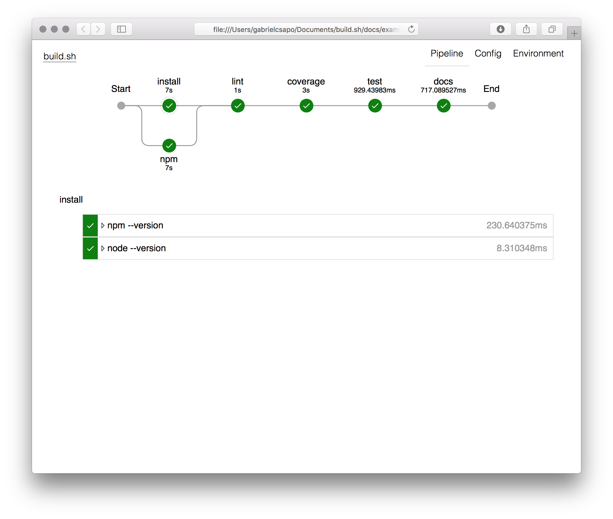
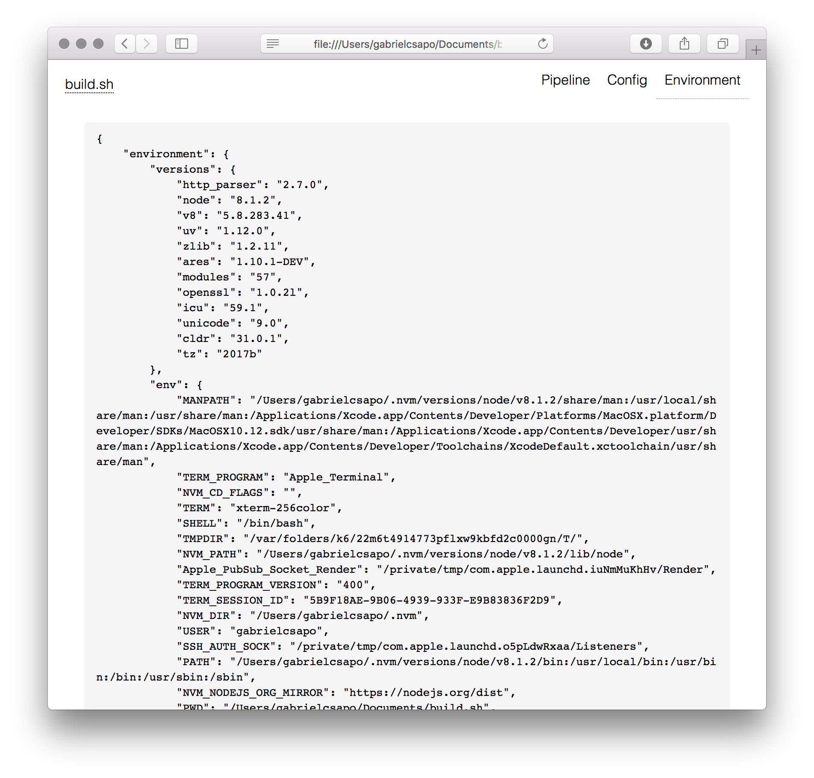
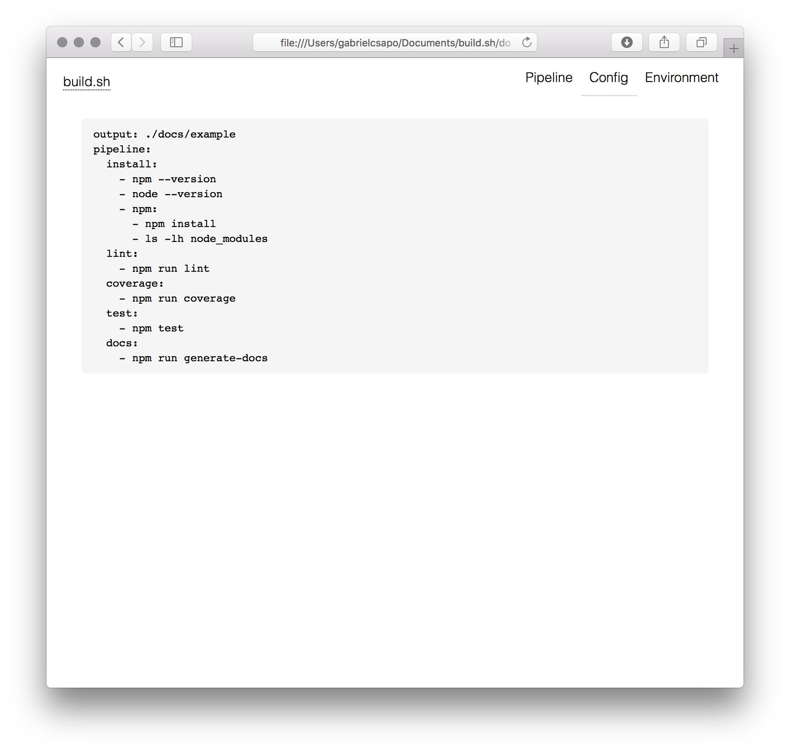

# build.sh

[](https://travis-ci.org/gabrielcsapo/build.sh)
[](https://david-dm.org/gabrielcsapo/build.sh)
[](https://david-dm.org/gabrielcsapo/build.sh#info=devDependencies)
[](https://lcov-server.herokuapp.com/coverage/github%2Ecom/gabrielcsapo/build.sh)
[]()
[]()

> 🔨 run and visualize the build process

<!-- TOC depthFrom:2 depthTo:6 withLinks:1 updateOnSave:1 orderedList:0 -->

- [Installation](#installation)
- [Usage](#usage)
- [How To](#how-to)

<!-- /TOC -->

## Installation

This module can be installed via npm, or for those who do not have node on their machines can use the packed binary found [here](https://github.com/gabrielcsapo/build.sh/releases) which can downloaded to your computer and run as a executable.

```
npm install build.sh -g
```

## Usage

```
Usage: build [options]


Options:

  -V, --version        output the version number
  -c, --config [file]  the input file for the build pipeline to run
  -d, --debug          outputs a debug file of the build process and data captured
  -h, --help           output usage information
```

## How To

> commit a `build.yml` file to your project root

```
env:
  - {key}={value}
pipeline:
  {key}:
    - {command}
    - {command}
```

To invoke about the pipeline simply run `build` at the project root.

The terminal output will show the pipeline being run and eventually will open the browser to the location of the final report.

This build pipeline:

```yaml
output: ./docs
env:
    - FOO=bar
pipeline:
  install:
    - npm --version
    - node --version
    - npm:
      - npm install
      - ls -lh node_modules
  lint:
    - npm run lint
  coverage:
    - npm run coverage
  test:
    - npm test
  docs:
    - npm run generate-docs
```

Will yield the following results:



Sometimes things go as planned and certain build phases will fail and that will yield:


An important factor when dealing with build pipelines is the persistence of environment variables and git information which is recorded and accessible via the `Environment` tab:



If the build report was ran and built using `build.sh` it will also record the yaml file that it ran with under the `Config` tab.


